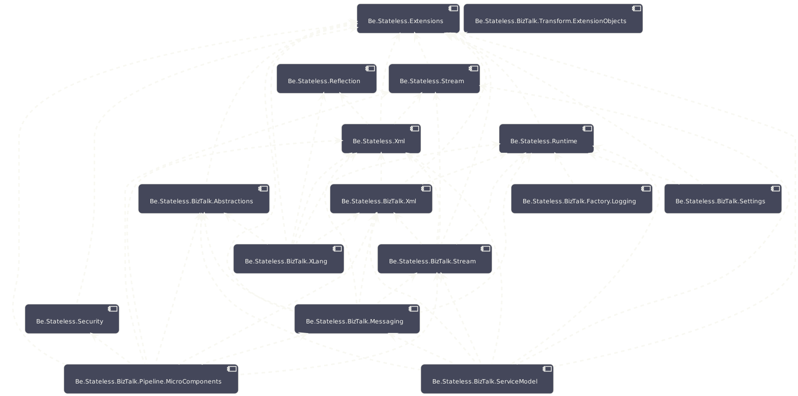

## Component Model

The following component diagram shows a comprehensive view of the components that are part of the `BizTalk.Factory Runtime` package where all the direct dependencies between components have been made explicit.

<!-- ![Component Diagram][component.diagram] -->

<!-- links -->

[component.diagram]: https://www.plantuml.com/plantuml/proxy?src=https://raw.githubusercontent.com/icraftsoftware/biztalk.factory.github.io/master/BizTalk/Factory/Runtime/ComponentModel.puml "Component Diagram"
